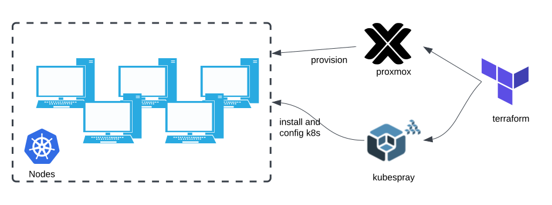

## Building Your Kubernetes Cluster
Get ready for the most exciting part—creating your very own Kubernetes cluster!

### Plan Overview
Here’s a step-by-step breakdown of the process using Terraform and Kubespray:

<div class="text-left">
  
</div>

- Set Up VMs: The VM's are already created with the previous step.
- Install Kubespray: Set up an additional VM and install Kubespray on it.
- Customize the Cluster:
  The Kubespray configuration files to match your needs:
    - `inventory.ini`
    - `addons.yaml`
    - `k8s-cluster.yaml`

### Deploy Kubernetes

Use Kubespray to transform the initial VMs into fully operational Kubernetes nodes.
!!! info "Don’t worry if this seems overwhelming!"
    The [xp-labs](https://github.com/surikbs-xp/xp-labs/tree/main/proxmox) repository includes pre-configured Terraform files to simplify the entire process.

- Here’s the simplified Steps:
  - Clone the repository.
  - Customize the Terraform variables for your setup.
  - Run a few Terraform commands.

Relax and enjoy your coffee while the setup completes.
Ready? Let’s get started!

## Starting the Deployment

Follow these steps to get started:

- Clone the proxmox-kubernetes repository:

    ``` bash
    git clone https://github.com/surikbs-xp/xp-labs.git
    ```

- Switch to the project directory:

    ``` bash
    cd proxmox
    ```
### Configuring and Deploying

#### Edit the Configuration File
  - Open the `cluster.tfvars` file in a text editor and update all the required variables with your own values.

#### Initialize Terraform
  - Run the following command to initialize the Terraform working directory

    ``` bash
    terraform init
    ```

#### Review the Execution Plan
  - Generate an execution plan and review it to ensure the planned changes match your expectations:

    ``` bash
    terraform plan -var-file="cluster.tfvars"
    ```

#### Apply the Changes
  - Once satisfied with the plan, execute the deployment by running:

    ``` bash
    terraform apply -var-file="cluster.tfvars"
    ```

#### Wait for Deployment
- Relax and enjoy a cup of coffee while Terraform completes the deployment process.


## Setting Up SSH Configuration
- Steps to Configure SSH:
  - Open the SSH Configuration File:
    On your local workstation, open the `~/.ssh/config` file using your preferred text editor.

  - Add the Bastion Host Profile:
    - Append the following block to define the SSH profile for your Bastion host:

        ``` bash
        # ~/.ssh/config
        Host k8s-bastion
          HostName 192.168.1.131
          User ubuntu
          Port 22
          IdentityFile ~/proxmox-kubernetes/ssh-keys/id_rsa
        ```
        Replace 192.168.1.131 with the public IP address of your Bastion host.

    - Configure Access to Kubernetes VMs:
      Add another block to specify how your SSH client can connect to the Kubernetes VMs via the Bastion host:

        ``` bash
        # ~/.ssh/config
        Host 10.0.1.*
            User ubuntu
            Port 22
            IdentityFile ~/proxmox-kubernetes/ssh-keys/id_rsa
            ProxyJump k8s-bastion
        ```

    !!! example "Example"
        `10.0.1.*` matches all hosts within the `10.0.1.0/24` Kubernetes network. Adjust this pattern to match your specific network CIDR. The ProxyJump directive ensures SSH traffic is forwarded through the Bastion host to the target VMs.

# Verifying the Kubernetes Cluster
Once the deployment is complete, it’s crucial to verify that all system pods in the Kubernetes cluster are running correctly.

### Steps to Verify
- Open a Terminal:

    Launch a terminal on your local workstation.

- Find the Control Plane IP:

    Identify the IP address of a Kubernetes control plane node. This information is available in the output of the terraform apply command.

- Access the Control Plane:
    Use `SSH` to connect to the control plane node:

      ``` bash
      ssh 10.0.1.10
      ```

- Check System Pods:
    On the control plane node, list all the pods in the kube-system namespace:

      ``` bash
      sudo kubectl get pods -n kube-system
      ```
A successful cluster deployment is indicated when all system pods show a status of Running. Below is an example of the expected output:

    ``` plaintext
    NAME                                   READY   STATUS    RESTARTS   AGE
    kube-apiserver-node1                  1/1     Running   0          5m
    kube-controller-manager-node1         1/1     Running   0          5m
    kube-scheduler-node1                  1/1     Running   0          5m
    ```
